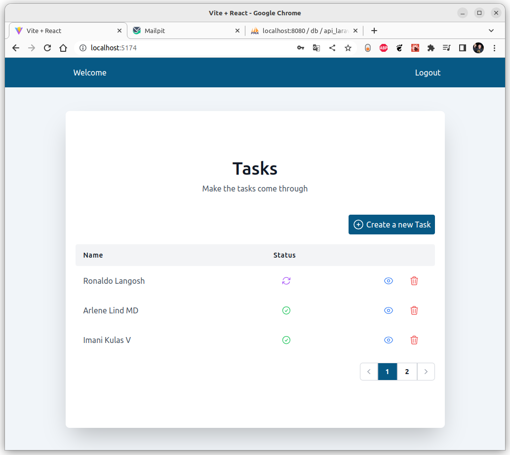

# Tasks App with React 3 and Laravel 10 Breeze Api

A simple tasks app in React 18 with Laravel 10 Breeze Api authentication, tanstack/react-query, axios, pagination, react router and tailwind.

# How to install

Before: Make sure you have installed the api-laravel project here : `https://github.com/molodoi/api-laravel`

1. Make: `git clone git@github.com:molodoi/react-tasks-laravel-breeze-api.git`
2. Make: `cd react-tasks-laravel-breeze-api`
3. Make: `npm install`
4. Make: `npm run dev`
5. Go localhost: `http://localhost:5174`

# Screenshot

